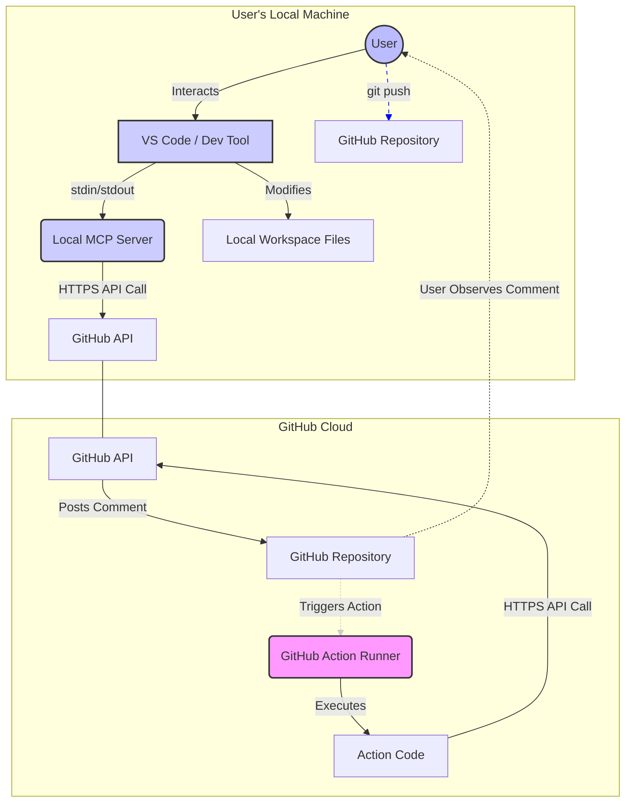

```mermaid
graph TD
    subgraph User's Local Machine
        direction LR
        User((User)) -- Interacts --> DevTool[VS Code / Dev Tool];
        DevTool -- stdin/stdout --> MCPServer(Local MCP Server);
        MCPServer -- HTTPS API Call --> GHApi2[GitHub API];
        %% MCP also calls API
        DevTool -- Modifies --> LocalFiles[Local Workspace Files];
        User -- git push --> GHRepo2[GitHub Repository];
        %% User pushes fix
    end

    subgraph GitHub Cloud
        direction LR
        GHRepo[GitHub Repository] -- Triggers Action --> Runner(GitHub Action Runner);
        Runner -- Executes --> ActionCode[Action Code];
        ActionCode -- HTTPS API Call --> GHApi[GitHub API];
        GHApi -- Posts Comment --> GHRepo;
        %% Action posts result
    end

    %% Link showing User observes the comment (indirect link)
    GHRepo -.-> |User Observes Comment| User;
    linkStyle 4 stroke:blue,stroke-dasharray: 5 5;
    %% Note: Indices might need checking due to added lines

    %% Styling
    style Runner fill:#f9f,stroke:#333,stroke-width:2px
    style MCPServer fill:#ccf,stroke:#333,stroke-width:2px
    style DevTool fill:#ccf,stroke:#333,stroke-width:2px
    style User fill:#bbf,stroke:#333,stroke-width:2px

    %% Make GH API nodes visually distinct if needed, or use same node
    %% Using same node ID implies it's the same API endpoint system
    GHApi2 --- GHApi;
    %% Visually link the API access points if desired
    linkStyle 5 stroke:#ccc,stroke-dasharray: 2 2;
    %% Note: Indices might need checking due to added lines
```